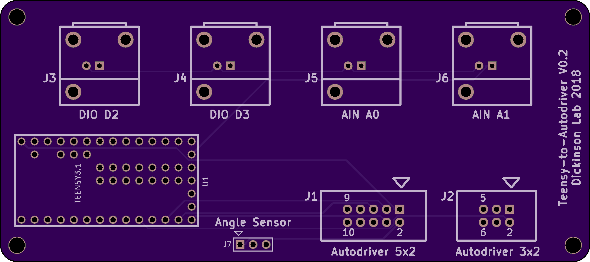
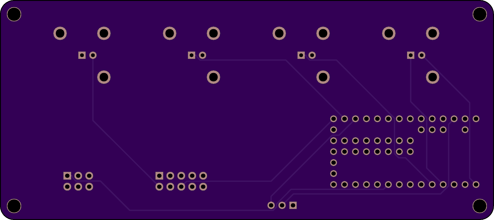

# teensy_to_autodriver
A simple PCB for connecting the Teensy3.2 to the Sparkfun Autodriver. [Schematic](teensy_to_autodriver.pdf).

# Top View: 

# Bottom View:

# License: 
Creative Commons Attribution 4.0 International CC BY 4.0
